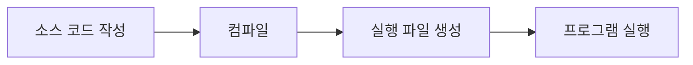

# C언어의 개요

## C언어란 무엇인가?

**C언어**는 1972년 데니스 리치(Dennis Ritchie)가 벨 연구소에서 개발한 프로그래밍 언어입니다.  
50년이 넘는 역사를 가지고 있지만, 여전히 전 세계에서 가장 많이 사용되는 프로그래밍 언어 중 하나입니다.

:::tip 핵심 개념
C언어는 **하드웨어를 직접 제어**할 수 있으면서도 **이식성이 뛰어난** 프로그래밍 언어입니다.
:::

---

## C언어의 특징

### 주요 특징

| 특징 | 설명 | 장점 |
|------|------|------|
| 절차적 언어 | 순서대로 명령을 실행 | 이해하기 쉽고 직관적 |
| 효율적 | 하드웨어 직접 제어 가능 | 빠른 실행 속도 |
| 이식성 | 다양한 플랫폼에서 동작 | 한 번 작성하면 여러 곳에서 사용 |
| 범용성 | 다양한 분야에 활용 | 시스템부터 응용까지 광범위 |
| 간결성 | 핵심 기능만 제공 | 배우기 쉽고 명확함 |

### C언어의 강점

**하드웨어 제어**
- 메모리를 직접 다룰 수 있는 포인터 제공
- 효율적인 메모리 관리 가능
- 임베디드 시스템에 최적화

**높은 성능**
- 컴파일 언어로 빠른 실행 속도
- 시스템 자원을 효율적으로 활용
- 게임, OS 개발에 적합

**이식성**
- 다양한 운영체제에서 동작 (Windows, Linux, Mac 등)
- 한 번 작성한 코드를 여러 플랫폼에서 재사용
- 표준화된 언어 규격 (ANSI C, C99, C11 등)

**다른 언어의 기초**
- C++, Java, Python 등 많은 언어가 C의 영향을 받음
- C를 배우면 다른 언어 학습이 수월함
- 프로그래밍의 기본 원리 이해에 도움

:::info 왜 C언어를 배워야 할까요?
C언어는 컴퓨터의 동작 원리를 이해하는 데 가장 좋은 언어입니다.  
메모리 관리, 포인터, 시스템 프로그래밍 등 컴퓨터 과학의 핵심 개념을 직접 경험할 수 있습니다.
:::

---

## C언어의 활용 분야

### 실생활에서 C언어가 사용되는 곳

**운영체제 (Operating System)**
- Windows, Linux, macOS의 핵심 부분
- 하드웨어와 소프트웨어를 연결하는 역할
- 효율적인 자원 관리

**임베디드 시스템**
- 스마트폰, TV, 세탁기 등 전자제품
- 자동차 제어 시스템
- IoT 기기

**게임 엔진**
- 고성능이 필요한 게임 개발
- 그래픽 처리 엔진
- 물리 엔진

**시스템 소프트웨어**
- 컴파일러, 인터프리터
- 데이터베이스 시스템
- 네트워크 프로그램

**과학 및 공학 계산**
- 시뮬레이션 프로그램
- 수치 해석
- 데이터 분석 도구

---

## C언어 프로그램의 구조

### 가장 간단한 C 프로그램
```c
#include <stdio.h>

int main() {
    printf("Hello, World!\n");
    return 0;
}
```

**코드 설명:**
- `#include <stdio.h>`: 표준 입출력 라이브러리 포함
- `int main()`: 프로그램의 시작점
- `printf()`: 화면에 문자를 출력하는 함수
- `return 0`: 프로그램 정상 종료

**실행 결과:**
```
Hello, World!
```

### 프로그램 구조 분석
```c
#include <stdio.h>     // 1. 전처리기 지시문

int main() {           // 2. main 함수 시작
    // 3. 프로그램 본문
    printf("안녕하세요!\n");
    
    return 0;          // 4. 함수 종료
}
```

**구성 요소:**

1. **전처리기 지시문**: `#include`로 필요한 라이브러리 포함
2. **main 함수**: 프로그램의 시작 지점
3. **프로그램 본문**: 실제 실행될 코드
4. **반환문**: 프로그램 종료 상태 반환

---

## C언어 개발 환경

### 프로그램 작성부터 실행까지


### 필요한 도구

**텍스트 에디터**
- Visual Studio Code
- Sublime Text
- Notepad++

**컴파일러**
- GCC (GNU Compiler Collection)
- Clang
- MSVC (Microsoft Visual C++)

**통합 개발 환경 (IDE)**
- Visual Studio
- Code::Blocks
- Dev-C++

:::warning 개발 환경 선택 팁
초보자라면 Code::Blocks나 Dev-C++ 같은 통합 개발 환경을 추천합니다. 컴파일러 설정 없이 바로 시작할 수 있습니다.
:::

---

## 첫 번째 프로그램 작성하기

### 사칙연산 계산기
```c
#include <stdio.h>

int main() {
    int num1, num2;
    int sum, sub, mul;
    float div;
    
    printf("두 정수를 입력하세요: ");
    scanf("%d %d", &num1, &num2);
    
    sum = num1 + num2;
    sub = num1 - num2;
    mul = num1 * num2;
    div = (float)num1 / num2;
    
    printf("\n=== 계산 결과 ===\n");
    printf("%d + %d = %d\n", num1, num2, sum);
    printf("%d - %d = %d\n", num1, num2, sub);
    printf("%d × %d = %d\n", num1, num2, mul);
    printf("%d ÷ %d = %.2f\n", num1, num2, div);
    
    return 0;
}
```

**실행 예시:**
```
두 정수를 입력하세요: 10 3

=== 계산 결과 ===
10 + 3 = 13
10 - 3 = 7
10 × 3 = 30
10 ÷ 3 = 3.33
```

### 조건문 활용 예제
```c
#include <stdio.h>

int main() {
    int score;
    
    printf("점수를 입력하세요 (0-100): ");
    scanf("%d", &score);
    
    if(score >= 90) {
        printf("학점: A\n");
    } else if(score >= 80) {
        printf("학점: B\n");
    } else if(score >= 70) {
        printf("학점: C\n");
    } else if(score >= 60) {
        printf("학점: D\n");
    } else {
        printf("학점: F\n");
    }
    
    return 0;
}
```

### 반복문 활용 예제
```c
#include <stdio.h>

int main() {
    int n;
    
    printf("구구단 몇 단을 출력할까요? ");
    scanf("%d", &n);
    
    printf("\n=== %d단 ===\n", n);
    for(int i = 1; i <= 9; i++) {
        printf("%d × %d = %d\n", n, i, n * i);
    }
    
    return 0;
}
```

**실행 예시:**
```
구구단 몇 단을 출력할까요? 7

=== 7단 ===
7 × 1 = 7
7 × 2 = 14
7 × 3 = 21
7 × 4 = 28
7 × 5 = 35
7 × 6 = 42
7 × 7 = 49
7 × 8 = 56
7 × 9 = 63
```

---

## C언어 학습 로드맵

### 단계별 학습 계획

| 단계 | 주제 | 난이도 |
|------|------|--------|
| 1단계 | 변수, 자료형, 연산자 | ⭐ |
| 2단계 | 조건문, 반복문 | ⭐⭐ |
| 3단계 | 배열, 문자열 | ⭐⭐ |
| 4단계 | 함수 | ⭐⭐⭐ |
| 5단계 | 포인터 | ⭐⭐⭐⭐ |
| 6단계 | 구조체, 파일 입출력 | ⭐⭐⭐ |

:::tip 학습 조언
C언어는 단계별로 차근차근 학습하는 것이 중요합니다. 특히 포인터는 많은 연습이 필요합니다.
:::

---