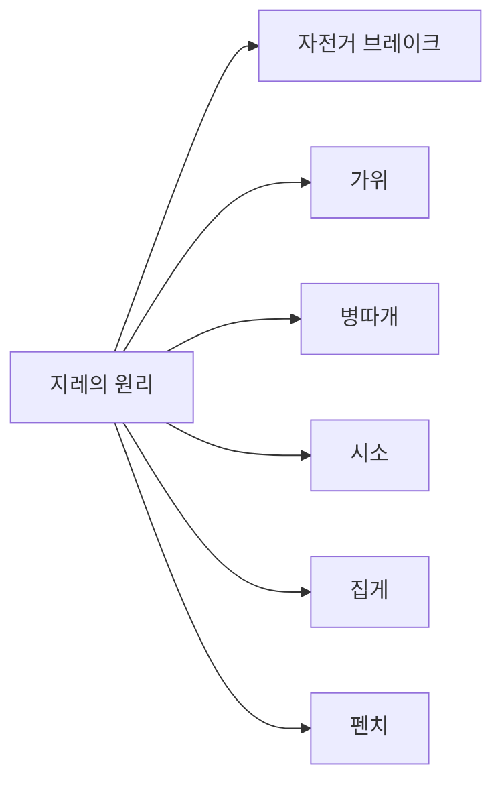

# 지레의 원리

> 작은 힘으로 큰 힘을 내는 과학의 기본 원리

## 지레란 무엇인가?

지레는 고대부터 현대까지 인류가 일상생활과 산업 현장에서 널리 활용해 온 간단하면서도 효과적인 도구입니다.  
막대기나 봉을 이용하여 무거운 물체를 적은 힘으로 들어 올리거나 움직일 수 있는 원리를 말합니다.

## 지레의 핵심 구성 요소

지레가 작동하기 위해서는 세 가지 핵심 요소가 필요합니다.

### 1. 힘점 (Point of Effort)
힘을 가하는 지점으로, 사용자가 힘을 주는 위치입니다.

### 2. 받침점 (Fulcrum)
지레가 움직이는 중심축 역할을 하는 지점입니다. 고정된 지점으로 회전의 기준이 됩니다.

### 3. 작용점 (Load Point)
힘이 작용하는 지점으로, 물체나 하중이 위치하는 곳입니다.

## 지레의 원리가 적용되는 구체적 사례

지레의 원리는 우리 주변의 다양한 도구와 기계에 활용되고 있습니다.



### 일상 속 지레의 예시

- **자전거**: 페달, 브레이크, 핸들 등에서 지레 원리 활용
- **가위**: 날과 손잡이 사이의 받침점을 중심으로 작동
- **병따개**: 적은 힘으로 병뚜껑을 개봉
- **문손잡이**: 회전 중심(받침점)에서 멀리 떨어진 곳에 힘을 가해 쉽게 개폐
- **펜치와 집게**: 손잡이를 잡는 힘점과 물체를 잡는 작용점의 거리 차이 활용

## 지레의 수학적 원리

지레의 원리는 수학적으로 표현할 수 있습니다. 물체가 평형 상태에 있을 때 다음 공식이 성립합니다.

### 회전력의 평형

```
F₁ × x₁ = F₂ × x₂
```

**변수 설명:**
- F₁: 힘점에 가해지는 힘
- F₂: 작용점에서의 힘 (물체의 무게)
- x₁: 받침점에서 힘점까지의 거리
- x₂: 받침점에서 작용점까지의 거리

### 원리 해석

이 공식에서 중요한 점은 거리의 비율입니다. 힘점이 받침점에서 멀수록,  
그리고 작용점이 받침점에 가까울수록 더 적은 힘으로 큰 힘을 낼 수 있습니다.

## 이종 지레의 개념

### 이종 지레란?

지레의 원리를 반복적으로 적용하여 더 큰 힘의 증폭 효과를 얻는 구조를 **이종 지레**라고 합니다.

### 이종 지레의 예시

손톱깎이는 대표적인 이종 지레 구조입니다.

```
제1 지레: 손잡이를 누르면 → 힘이 5배 증폭
제2 지레: 증폭된 힘이 다시 → 2배 증폭
최종 결과: 1의 힘 → 10배 증폭
```

약 10cm 거리에서 힘을 가하면 약 2cm 위치의 받침점을 통해 5배의 힘이 발생하고,  
이 힘이 다시 약 1.5cm 위치의 두 번째 받침점을 거쳐 약 3cm 위치의 작용점에 전달됩니다. 

이런 방식으로 작은 힘이 여러 단계를 거쳐 증폭되어, 최종적으로 단단한 손톱을 자를 수 있는 충분한 힘이 만들어집니다.

## 경제학에서의 레버리지

지레는 영어로 **Lever(레버)**라고 하며, 여기서 파생된 용어가 **Leverage**(레버리지)입니다.

### 금융 레버리지의 의미

경제와 금융 분야에서 레버리지는 작은 자본으로 큰 효과를 만들어내는 전략을 의미합니다. 마치 지레처럼 적은 힘(자본)으로 큰 결과(수익)를 만들어낸다는 개념입니다.

### 레버리지 예시: 환율 거래

현재 1달러가 1,000원이라고 가정해봅시다.

**레버리지 없는 거래:**
- 1달러를 1,000원에 구매
- 환율이 1,010원으로 상승
- 10원의 수익 발생

**레버리지 25배 적용:**
- 1,000원으로 25달러 상당 거래 가능 (1달러 × 25배 = 25달러)
- 환율이 1,010원으로 10원 상승
- 25달러 × 10원 = 250원의 수익
- **투자금 1,000원 대비 25% 수익률**

:::caution 주의사항
레버리지는 수익을 증폭시키지만, 동시에 손실도 증폭시킵니다. 금융에서 레버리지를 사용할 때는 위험 관리가 필수적입니다.
:::

## 연습 문제

### 문제 1: 지레의 힘 계산

왼쪽 그림과 같이 막대기의 왼쪽 끝에 크기 1의 힘을 가했을 때, 오른쪽 끝에 있는 물체에 작용하는 힘의 크기는 얼마일까요?

```
      F₁                                    힘 = ?
       ↓                                      ↓
    [====================================]
              ▲ (받침점)
```

**조건:**
- 받침점에서 힘점까지의 거리: 3
- 받침점에서 작용점까지의 거리: 1

**풀이:**

지레의 원리 공식에 따라:
```
F₁ × x₁ = F₂ × x₂
1 × 3 = F₂ × 1
F₂ = 3
```

**답: 3배의 힘이 작용합니다.**

## 핵심 요약

- 지레는 받침점을 중심으로 힘점과 작용점의 거리 비율을 이용해 힘을 증폭시키는 원리입니다
- 힘점이 받침점에서 멀수록 적은 힘으로 큰 효과를 낼 수 있습니다
- 이종 지레는 지레의 원리를 여러 번 적용하여 더 큰 증폭 효과를 만듭니다
- 레버리지 개념은 물리학을 넘어 경제, 금융 등 다양한 분야에 응용됩니다

---
